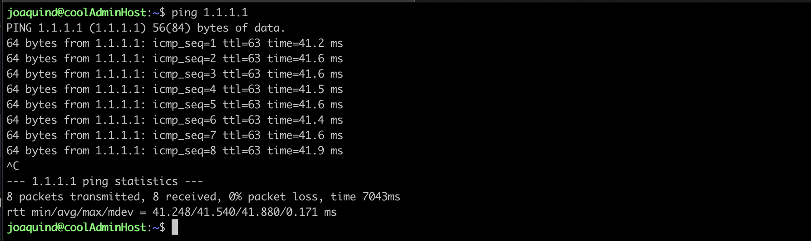
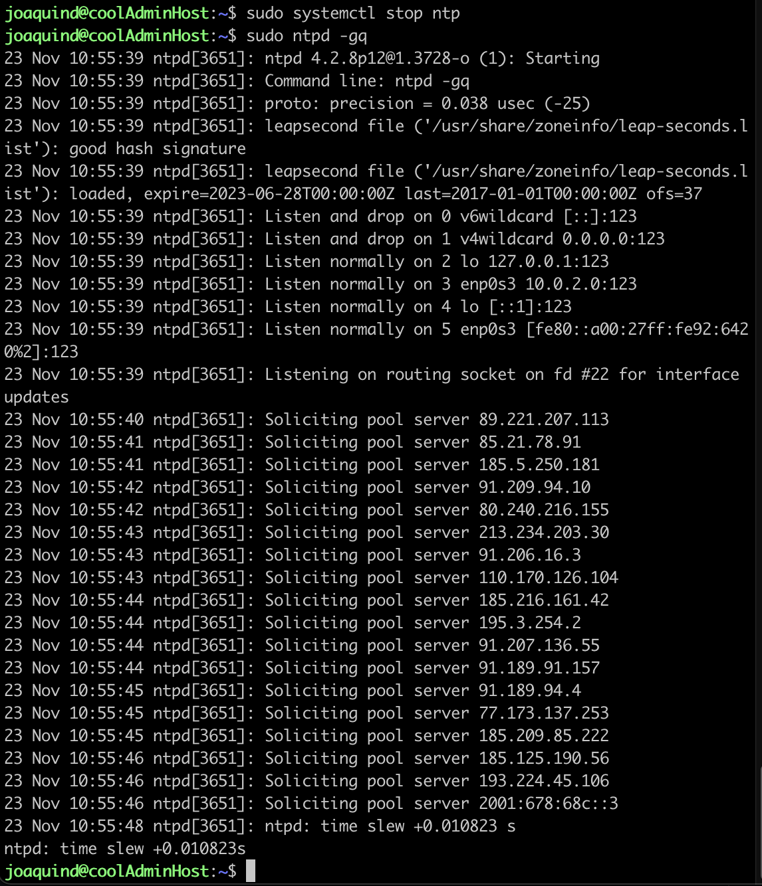
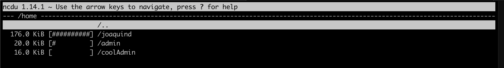

## Part 1. Установка ОС
Для установки ОС скачиваем серверную версию Ubuntu 20.04 с официального сайта https://releases.ubuntu.com/focal/. В VirtualBox создаем новую виртуальную машину, указываем имя и тип ОС, выделяем оперативную память и создаем новый виртуальный жесткий диск (динамический).
Запускаем ОС, выбираем язык, нажимаем done до момента создания пользователя. Устанавливаем OpenSSH-сервер и ждем установки системы. Rebbot'ем систему.
После запуска вводим login и password. Система готова.

## Part 2. Создание пользователя
Создаем пользователя coolAdmin через команды, представленные на скриншотах

Проверяем его нахождение в группе adm

## Part 3. Настройка сети ОС
Меняем имя хоста на user-1 через sudo vim /etc/hostname

Проверяем текущее локальное время timedatectl

Устанавливаем локальное время по часововму поясу Москвы

Выводим название сетевых интерфейсов с помощью ip a, сбрасываем старый ip-адрес. 
Интерфейс lo используется как средство межпроцессного обмена информацией локальных процессов и присутствует по-умолчанию в любом Linux.

Получаем ip адрес рабочего устройства от DHCP сервера. DHCP - Dynamic Host Configuration Protocol, протокол автоматизации назначения IP-адреса клиенту.

Определяем внешний и внутренний ip адреса

Задаем статичные настройки ip, gw, dns

Перезагружаем систему sudo reboot. Проверяем сетевые настройки - совпадают

Пропинговываем удаленные хосты 1.1.1.1 и ya.ru. Убеждаемся, что нет потерь пакетов

## Part 4. Обновление ОС
Обновляем систему через sudo apt update -> sudo apt dist-upgrade. При повторной попытке обновления - обновления отсутствуют

## Part 5. Использование команды sudo
Создаем папку с правами для пользователя coolAdmin sudo touch /etc/sudoers.d/coolAdmin.
Sudo (Substitute User and do, дословно «подменить пользователя и выполнить») — программа для системного администрирования UNIX-систем, позволяющая делегировать те или иные привилегированные ресурсы пользователям с ведением протокола работы. Основная идея — дать пользователям как можно меньше прав, при этом достаточных для решения поставленных задач. Программа поставляется для большинства UNIX и UNIX-подобных операционных систем.

Команда sudo предоставляет возможность пользователям выполнять команды от имени суперпользователя root, либо других пользователей. Правила, используемые sudo для принятия решения о предоставлении доступа, находятся в файле /etc/sudoers (для редактирования файла можно использовать специальный редактор visudo, запускаемый из командной строки без параметров, в том числе без указания пути к файлу); язык их написания и примеры использования подробно изложены в man sudoers(5).

В большинстве случаев грамотная настройка sudo делает небезопасную работу от имени суперпользователя ненужной. Все действия оказываются выполнимы из-под аккаунта пользователя, которому разрешено использовать sudo без ограничений. Имеется возможность запрещать и разрешать определённым пользователям или группам выполнение конкретного набора программ, а также разрешить выполнение определённых программ без необходимости ввода своего пароля.

Редактируем через vim, добавляя строку "coolAdmin ALL=(ALL:ALL) ALL".

Заходим через пользователя coolAdmin - su coolAdmin. Меняем имя хоста sudo vim /etc/hostname. Ребутаем систему, наслаждаемся изменениями. 

## Part 6. Установка и настройка службы времени
Установка network time protocol sudo apt install -y ntp

Останавливаем ntp и синхронизируем время

Запуск ntp и проверка состояния службы

Проверка синхронизации - не синхронизированно. После удаления ntp синхронизация состоялась

## Part 7. Установка и использование текстовых редакторов
VIM и NANO уже предустановлены в Ubuntu, устанавливаем только MCEDIT

VIM: сохранение и выход ":wq", выход без сохранения ":q!", поиск "/(искомое слово)", поиск и замена ":s /(искомое слово)/(замена)/g(если необходимо заменить во всем файле)";

NANO: сохранение и выход "control+o - control+x", выход без сохранения "control+x - No", поиск "control+w", поиск и замена ":control + \";

MCEDIT: сохранение и выход "Save - Quit", выход без сохранения "Quit", поиск "Search", поиск и замена "Replace".

Скриншот с выводом содержимого файлов после выхлода без сохранения

## Part 8. Установка и базовая настройка сервиса SSHD
Настройка SSHD:

Заходим по нашим пользователем в окне virtualbox и вводим команду:  
sudo nano /etc/ssh/sshd_config. 
Удаляем комментарий рядом с надписью #Port 22 и меняем цифру 22 на 2022. Так же разрешаем логиниться под root.  
Далее разрешаем как логин по ключу, так и логин по паролю:  
Сохраняем, закрываем, перезапускаем демона. 
После проверяем что демон перезапустился, командой sudo service sshd status. 

Настройка файервола:

sudo ufw status - status inactive. 
активируем его командой sudo ufw enable - Firewall is active and enable on system startup. 
sudo ufw allow 2022. 
Rule added. 
Rule added (V6). 

Удалённое подключение ssh joaquind@localhost -p 2022. 

Генерация ключей:   
cd .ssh. 
mkdir joaquind. 
cd joaquind && pwd. 
ssh-keygen. 
вставляем путь из pwd. 
Передать сгенерированный ключ нашему хосту:
ssh-copy-id -i id_rsa.pub joaquind@localhost -p 2022. 

Создание конфига ssh:
nano ~/.ssh/config. 
Host localhost. 
IdentityFile ~/.ssh/joaquind/id_rsa. 

sudo nano /etc/ssh/sshd_config. 
снимаем комментарий со строки AuthorizedKeysFile. 
комментируем строку PasswordAuthentication. 
reboot. 
sudo service sshd restart. 
control + d. 

Значение ключей -tan, значение каждого столбца вывода, значение 0.0.0.0.
ps aux | grep sshd. 
a - указывает ps вывести на дисплей процессы всех пользователей, за исключением тех процессов, которые не связаны с терминалом и процессами группы лидеров.  
u — подставки для ориентированных на пользователя формате, который обеспечивает подробную информацию о процессах.  
x - ps перечисляет процессы без управляющего терминала. В основном это процессы, которые запускаются во время загрузки и работают в фоновом режиме.  

nano /etc/ssh/sshd_config  
netstat -tan. 

netstat (network statistics) — утилита командной строки, выводящая на дисплей состояние TCP-соединений (как входящих, так и исходящих), таблицы маршрутизации, число сетевых интерфейсов и сетевую статистику по протоколам. Доступна в операционных системах семейства UNIX и Windows. Основное назначение утилиты — поиск сетевых проблем и определение производительности сети.  
-t : Показать ссылку, к которой подключен TCP. 
-a : Все статусы. 
-n : Отображение IP и ПОРТА в цифровом формате. 

proto - Протокол (обычно unix), используемый сокетом.

Recv-Q - Счётчик байт не скопированных программой пользователя из этого сокета.

Send-Q - Счётчик байтов, не подтверждённых удалённым узлом.

Local Address - Адрес и номер порта локального конца сокета. Если не указана опция --numeric (-n), адрес сокета преобразуется в каноническое имя узла (FQDN), и номер порта преобразуется в соответствующее имя службы.

Foreign Address - Адрес и номер порта удалённого конца сокета. Аналогично "Local Address."

state Состояние сокета. Поскольку в режиме raw нет состояний, а в режиме UDP состояния обычно не испольуются, эта колонка может оставаться пустой. Обычно состояние может принимать одно из нескольких значений:

ESTABLISHED - соединение установлено. 
SYN_SENT - сокет пытается установить соединение   
SYN_RECV - начальная синхронизация соединения. 
FIN_WAIT1 - сокет закрыт, ожидание отключения соединения. 
FIN_WAIT2 - ожидание отключения удаленной стороны
TIME_WAIT - ожидание после закрытия повторной передачи отключения удаленной стороны. 
CLOSED - соединение закрыто, сокет не используется. 
CLOSE_WAIT - удаленный узел отключился, сокет скоро будет закрыт. 
LAST_ACK - сначала отключилась удаленная сторона, а затем сокет будет закрыт. 
LISTEN - сокет ожидает входящих соединений. 
CLOSING - закрытие сокета, точнее сокет закрыт, а затем отключился удаленный узел. 
UNKNOWN - состояние сокета неизвестно.

IP-адрес 0.0.0.0 — это немаршрутизируемый адрес IPv4, который можно использовать в разных целях, в основном, в качестве адреса по умолчанию или адреса-заполнителя. Несмотря на то, что адрес 0.0.0.0 может использоваться в компьютерных сетях, он не является адресом какого-либо устройства.

:* обозначает, что поля порта удаленного адреса еще не заполнены.

## Part 9. Установка и использование утилит top, htop
top :

uptime - 5 hours 28 minutes;
количество авторизованных пользователей - 2 users;
общую загрузку системы - 0;
общее количество процессов - 123;
загрузку cpu - 0;
загрузку памяти - MiB Mem - 198.7, MiB Swap - 0;
pid процесса занимающего больше всего памяти - сортируем Shift+M - snapd

pid процесса, занимающего больше всего процессорного времени - выходим через "q", самый верхний процесс - systemd

htop:
отсортированному по PID, PERCENT_CPU, PERCENT_MEM, TIME

отфильтрованному для процесса sshd - F4 Filter sshd

с процессом syslog, найденным, используя поиск - F3 Search syslog

с добавленным выводом hostname, clock и uptime - F2 Setup - Добавляем нужные опции

## Part 10. Использование утилиты fdisk
Запустить команду fdisk -l

Название жесткого диска - /dev/sda. 
Размер - 10 Gib. 
Количество секторов - 20971520. 
Размер swap - sudo swapon --show - 1.5G. 

## Part 11. Использование утилиты df

Запустить команду df

В отчёте написать для корневого раздела (/):

размер раздела - 8408452. 
размер занятого пространства - 4332572. 
размер свободного пространства - 3627164. 
процент использования - 55%. 

Определить и написать в отчёт единицу измерения в выводе - блоки по 512 байт. 

Запустить команду df -Th.

В отчёте написать для корневого раздела (/):

размер раздела - 8.1G
размер занятого пространства - 4.2G
размер свободного пространства - 3.5G
процент использования - 55%

Определить и написать в отчёт тип файловой системы для раздела - гигабайты

## Part 12. Использование утилиты du

Запустить команду du.

Вывести размер папок /home, /var, /var/log (в байтах, в человекочитаемом виде) - используем du -bh

Вывести размер всего содержимого в /var/log (не общее, а каждого вложенного элемента, используя "\*") - используем du -bh /var/log/*

## Part 13. Установка и использование утилиты ncdu
Устанавливаем sudo apt install ncdu

Вывести размер папок /home, /var, /var/log - команда ncdu /

## Part 14. Работа с системными журналами

Открыть для просмотра:

команда tail
1. /var/log/dmesg
2. /var/log/syslog
3. /var/log/auth.log

Написать в отчёте время последней успешной авторизации, имя пользователя и метод входа в систему - 17:51:59, joaqund.

Перезапустить службу SSHD - sudo service sshd restart

Вставить в отчёт скрин с сообщением о рестарте службы (искать в логах).

## Part 15. Использование планировщика заданий CRON

Используя планировщик заданий, запустите команду uptime через каждые 2 минуты.

Команда crontab -e, выбираем редактор (взял VIM), добавляем под комментариями строку "*/2 * * * * uptime | wall"

Найти в системных журналах строчки (минимум две в заданном временном диапазоне) о выполнении.

Вывести на экран список текущих заданий для CRON.

Вставить в отчёт скрины со строчками о выполнении и списком текущих задач.

Удалите все задания из планировщика заданий.

В отчёт вставьте скрин со списком текущих заданий для CRON.

